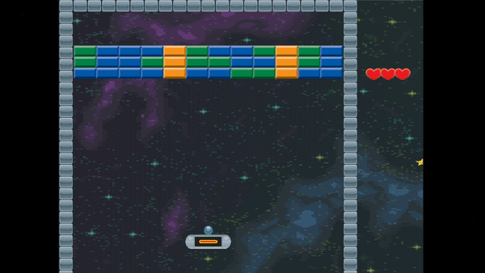

# Arkanoid Game
## Sections

 - [Visuals](#visuals)
 - [Description](#description)
	 - [Overview](#overview)
	 - [Player](#player)
	 - [Ball](#ball)
	 - [Environment](#environment)
	 - [Win and loss conditions](#win-and-loss-conditions)
	 - [Programming languages and libriaries](#programming-languages-and-libraries)
	 - [Main features](#main-features)
 - [Usage](#usage)

## Visuals

## Description

### Overview
The player controls a platform which can move left and right. The goal is to destroy all 
blocks by deflecting the ball with the platform. 

### Player
The player can move a platform using left and right arrow keyboard buttons. Initially the 
player can choose the angle of the ball by pressing the left mouse button.

### Ball
The ball speed is not constant. Every reflection from edges increases the speed by 10%. Speed is decreased by 10% on destroying a block. Deflecting by a platform has no impact on the speed. Minimum speed is 40% and maximum is 300% of a default speed.

### Environment
The level consists of different types of blocks which have different number of hit points. Blue blocks are destroyed from the first hit, Green ones - from the second, Gold blocks are indestructible. There are available two abilities. The first ability (positive) gives a “saving wall” and the second one (negative) damages the player. Saving wall appears on the bottom edge and deflects a ball if a player misses it. Wall can be used one time (it can save from only one missed ball).

### Win and loss conditions

The player loses when the ball is not caught by the platform. Victory can be achieved by 
destroying all blocks and catching the ball with the platform after.
The game is restarted after victory/loss.

### Programming languages and libraries

 - C++ 

### Main features
- Frame independent movement
- Line tracing
- Circle collision detection
- Linear interpolation

## Usage
- Fun
